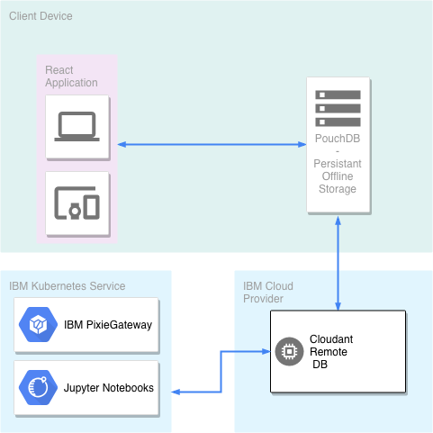

# aLocate: Solving relief networks during disaster scenarios

IBM's Call for Code Hackathon Repository. A tool for medical practitioners and relief organizers to track and manage resources and needs within an affected area.

# What is aLocate?

The process of administering aid after a natural disaster is as chaotic as the natural disaster itself.

The triage process is plagued with inefficiencies, and aid workers are ill-equipped to report the supply shortages and surpluses they deal with. Healthcare aid workers face incredible difficulties entering and querying patient health records due to internet outages. Furthermore, patients are often separated from their families and have no way to keep track of lost family members.

Additionally, aid supply networks often fail since there is little to no live and centralized information regarding current supply shortages. Uninformed networks often lead to inefficient and untimely allocations of resources with far reaching consequences.

We designed aLocate to solve both of these issues. aLocate is an offline/online progressive web application that works regardless of connectivity and powers robust analytics, data science, and supply chain optimization tools.

1. Connectivity is tenuous at best. We developed a progressive web app that continues to function even when offline.

The front end component of aLocate is used by doctors and volunteers aiding patients. aLocate allows volunteers to enter information, query health records and submit supply requests. This tool functions regardless of whether or not it is connected to the internet and refreshes/updates information from the central database once it establishes a stable internet connection. Furthermore, since families are often separated, this tool allows for aid workers to query patients in the database (who agree to HIPAA privacy waivers) to locate information about their loved ones

2. Analytics are scarce. We used IBM's PixieDust to develop insights and visualizations of disaster-affected areas.
   The back-end component of aLocate allows triage and supply analysts to properly understand the needs of an area and optimize supply distribution. Data entered by doctors and aid workers automatically synchronize with our analytics tool powered by IBM PixieDust. With little to no experience, analysts can leverage some of the most sophisticated tools available to data scientists. Our PixieDust implementation allows analysts to develop robust maps, charts, and graphs showing the granular details of an affected area. This tool enables analysts to gain a detailed understanding of an affected area and make informed decisions on how to allocate resources.

3. Predicting where supplies can be allocated can mean the difference between life and death. We employ reinforcement learning to find optimal supply distribution strategies.

We implemented a supply optimization algorithm that uses reinforcement learning to determine the best distribution of aid given the stochastic nature of demand. This algorithm uses Markov Decision Processes to sample the probability space of all possible supply allocations and predicts the allocation of resources with the highest likelihood of producing a good outcome.

# Running the app

First `cd PatientList`

Then `npm install && npm start`

Finally view the app at localhost:3000
